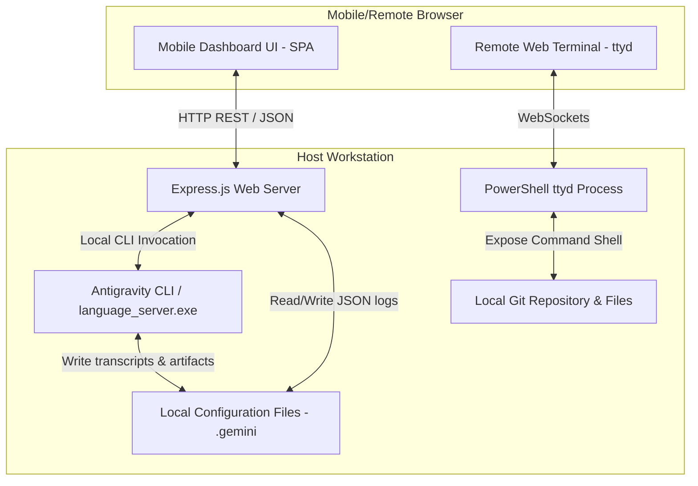

# Product Design Document: Antigravity Mobile Command Center

## 1. Executive Summary
The **Antigravity Mobile Command Center** is a responsive, web-based dashboard and terminal access portal designed to extend the capabilities of the Antigravity AI coding assistant to remote and mobile environments. 

By wrapping local daemons and command-line interfaces inside an authentication-protected Express.js backend and a glassmorphic HTML5/JS Single-Page Application (SPA), developers can monitor agent status, authorize command runs, review outputs, and debug code via their mobile devices on the same local network.

---

## 2. System Architecture

The application is structured as a lightweight client-server architecture running locally on the developer's workstation:

### 2.1 Backend Layer (Express.js)
* **Server Daemon**: Listens on port `8080` (Basic Auth protected).
* **CLI Interfacing**: Communicates with the core Antigravity engine by invoking `language_server.exe` with appropriate environmental variables (`ANTIGRAVITY_LS_ADDRESS`, `ANTIGRAVITY_CSRF_TOKEN`, `ANTIGRAVITY_PROJECT_ID`).
* **Active Port Discovery**: Scans local active daemons (reading `~/.gemini/antigravity/daemon/ls_*.json`) or checks active environment variables to locate the running Language Server API port and CSRF token.
* **Log Aggregation**: Reads conversation transcripts (`transcript.jsonl`) and artifacts straight from `~/.gemini/antigravity/brain/` and formats them for the frontend.

### 2.2 Frontend Layer (Single-Page App)
* **Tech Stack**: Vanilla HTML5, CSS Custom Properties (CSS variables), and modern ES6 Vanilla JavaScript.
* **Responsive Design**: Mobile-first layout with responsive drawers (drawers slide in/out on touch devices), glassmorphic card widgets, loading skeleton shimmers, and dynamic notifications.
* **Controls**: Live-polling message view, custom rendering for markdown content, structured metadata, expandable thinking blocks, and dynamic action pills.

### 2.3 Remote Terminal Layer (`ttyd`)
* **Terminal Sharing**: Shares a secure PowerShell terminal via a web browser over WebSockets using the `ttyd` engine.
* **Auto IP Binding**: Resolves local Wi-Fi/Ethernet adapters automatically using PowerShell to facilitate painless connection setups on mobile devices.

---

## 3. Data Flows

### 3.1 Initial Loading & Project Discovery
1. Client requests `GET /api/projects` and `GET /api/conversations`.
2. Backend scans `~/.gemini/config/projects/*.json` to list active workspaces.
3. Backend scans directories in `~/.gemini/antigravity/brain/` and reads the first/last lines of `transcript.jsonl` files to compile conversation lists sorted by latest activity.
4. Client UI populates sidebar sections with skeleton loaders resolving to interactive lists.

### 3.2 Message Exchange & Agent Execution
1. User writes a prompt (or clips a quick action pill like "Allow" or "Deny") and hits Send.
2. Client sends a request to `POST /api/conversations/:id/message`.
3. Backend checks active processes, locates the active `language_server.exe` endpoint, and forwards the command via subprocess invocation.
4. The agent writes status/thinking steps continuously to the local `transcript.jsonl` file.
5. Client performs short-polling on `GET /api/conversations/:id` to display the agent's step-by-step thinking logs and command outputs in real-time.

---

## 4. API Endpoint Specifications

All endpoints (except `/api/health` and specific artifact downloads) require HTTP Basic Authentication headers.

| Endpoint | Method | Description | Request Body / Parameters | Response Format |
| :--- | :--- | :--- | :--- | :--- |
| `/api/health` | `GET` | System health check (public) | None | `{"status":"ok", "uptime":...}` |
| `/api/projects` | `GET` | Retrieve list of all projects | None | List of project configuration objects |
| `/api/projects/new` | `POST` | Create a new project directory | `{"name": "App", "folderUri": "..."}` | `{"success": true, "project": {...}}` |
| `/api/conversations` | `GET` | Fetch all historical conversations | None | List of sorted conversation metadata |
| `/api/conversations/:id` | `GET` | Fetch conversation transcript | `id` (UUID format) | List of formatted chat/thinking steps |
| `/api/conversations/:id/metadata` | `GET` | Retrieve specific session metadata | `id` (UUID format) | Metadata details from daemon |
| `/api/conversations/new` | `POST` | Launch a new AI agent conversation | `{"prompt": "...", "model": "...", "projectId": "..."}` | Launch result details |
| `/api/conversations/:id/message` | `POST` | Post new message / reply to agent | `{"content": "..."}` | Agent command response |
| `/api/conversations/:id/artifacts` | `GET` | List artifacts for a conversation | `id` (UUID format) | List of artifact files with contents |
| `/api/conversations/:id/artifacts/:filename` | `GET` | Download/view specific artifact (public) | `id`, `filename` | File payload download stream |
| `/api/upload` | `POST` | Handle image or code file uploads | `{"filename": "...", "base64": "..."}` | `{"success": true, "path": "..."}` |

---

## 5. Security & Authentication

### 5.1 Basic Authentication
The backend enforces Basic Authentication for the entire routing space.
* **Credentials**:
  - **Username**: `admin`
  - **Password**: `AntiGravity2025!`
* **Auth Exclusions**:
  - `/api/health`: Accessible without authentication to check server running status.
  - `/api/conversations/:id/artifacts/:filename`: Bypasses authentication because standard browser media tags (like `` and `<a>`) cannot inject auth headers natively. To prevent leaks, files use unguessable 128-bit UUIDs within their paths.

### 5.2 Terminal Isolation
* The terminal is shared via WebSockets and bounded by credentials (`admin` / `AntiGravity2025!`) configured during execution.
* The script disables cross-origin requests by default unless explicitly configured, ensuring access is strictly restricted to local network connections.
